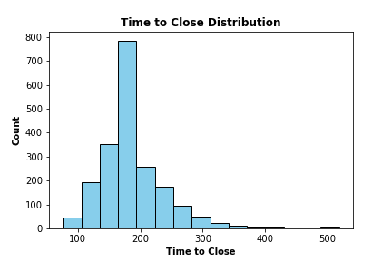
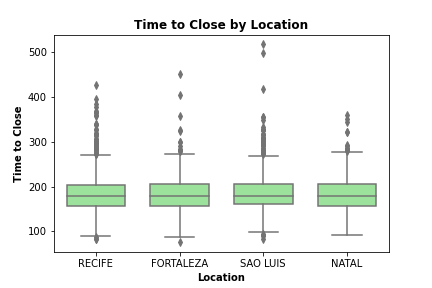
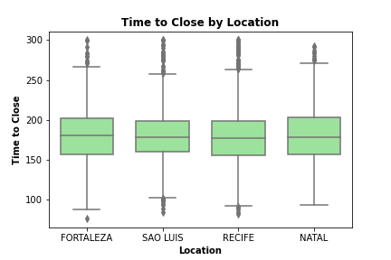

# Food_Claims_Process

Claim ID: There are 2000 values that make up the whole dataset as each row is the unique identifier. There are no missing values due to the database structure. No changes were made to this column.

Time To Close: All of the 2000 values in this column are positive. There were no missing values. No values were replaced with the overall median time to close.

Claim Amount: The values in total are in the currency fo Brazil and rounded to two decimal places. There were no missing values so no changes were made to this column.

Amount Paid: There are 36 values that are not rounded to two decimal places, instead are whole numbers. Nonetheless, the values match the description. In addition, 36 values are also null. All missing values were replaced with the overall median amount paid.

Location: This column has four categories, that match those in the description. There were no missing values and no changes were made to this column.

Individuals On Claim: This column has all values where the minimum is one, which matches the description. There were no missing values and no changes were made to this column.

Linked Cases: All of the values for the majority in this column were either TRUE or FALSE. There were 26 values that were missing. All missing values were replaced with False.

Cause: Most of the values fit the description of the three categories. There were no missing values, however there were extra categories. that either were all uppercase or had extra whitespace. These were manipulated to match the three main categories.

There are four possible types of locations in this data. Based on the bar graph above, the location with the most number of claims is RECIFE, with SAO LUIS being second with slightly more than half as many observations. Looking further into the graph, the observations are not balanced across the variable locations, with most claims coming from RECIFE and SAO LUIS. This graph supports that the legal team should focus on the city of RECIFE to improve customer replies and closing claims much efficiently.

As the legal team thinks that the claims that take the longest to close should be of most concern, we should look at how the time to close on these claims are distributed. 

Looking at the count of each time period to close these claims, we can see below that most claims take about 160 - 200 days to complete. The distribution on the time to close is right skewed. There are some outliers that take more than 300 days (almost a year) to complete. However, from the data, this is uncommon. 

When determining on which claims to improve on, they should focus on claims that average at least about 160 - 200 days. However, the legal team may choose to look into claims that take longer for further investigation if they wish. 

Finally, we want to show the correlation between location and the time to close on claims. So far, claims in RECIFE that take at least about 160 - 200 days to close would be ideal to focus but we need to further look at the two variables together to see if it still stands.

When looking at the graph below, we can see there are many outliers above the box plot for each location. In addition, the interquartile range for each location look very similar. We can filter the time to close column to only include data between 70 and 300 days. 

After we remove the outliers we can focus on the main range of data. The interquartile range for all the locations look very similar after the change. We can note that the interquartile range for SAO LUIS is smaller than the other locations. This suggests that there is less variablity in the time to close on these claims. With RECIFE having the most claims with time to close from 160 - 200 days, the graph below doesn't seem to show evidence that the legal team should just focus on claims from RECIFE. 

Based on all the above, we recommend the legal team to focus on each location with claims that take at least 160 - 200 days to complete. But the team should have an open mind to focus solely on RECIFE as they have the most number of claims amongst other locations and within the range of 160 - 200 days. Further analysis should be done to understand if claim amount also impacts the time it takes to close claims. The legal team should also consider on other factors such as the cause of the claim in order find its correlation on the region to determine if there is a major food problem in each region.
